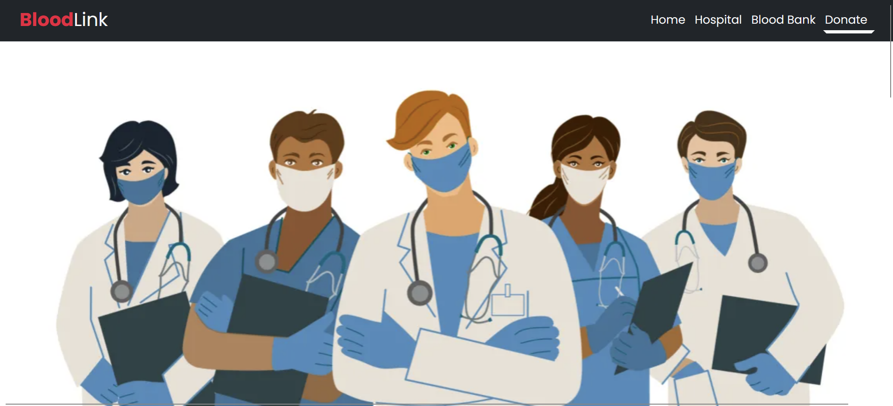
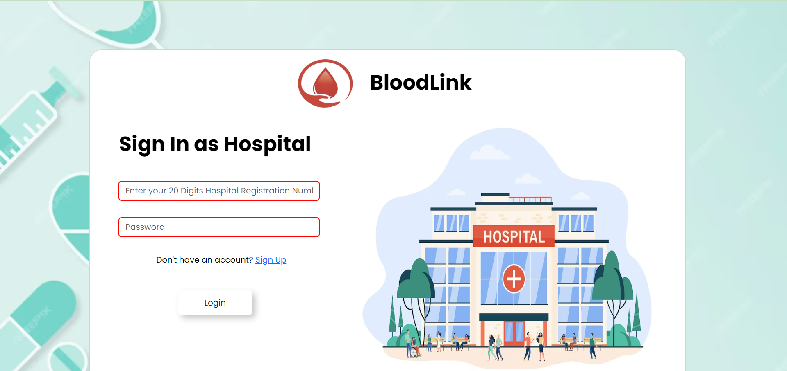
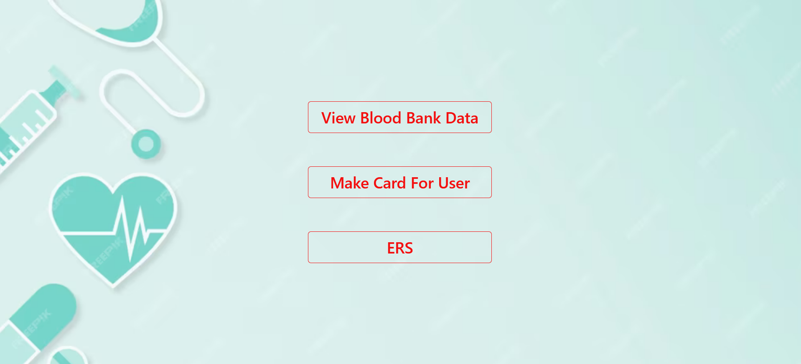
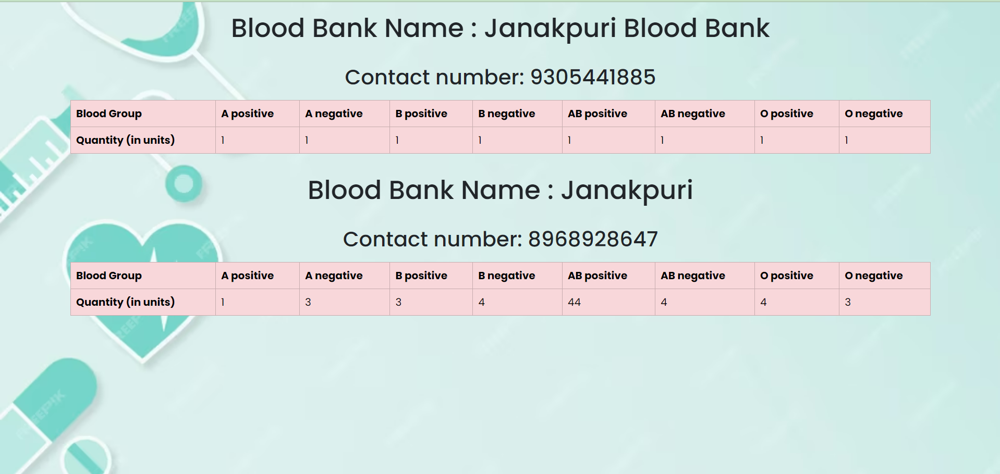

# BloodLink

BloodLink is a web application designed to facilitate blood donation and management, connecting blood donors, hospitals, and blood banks efficiently.

### Screenshots

## Table of Contents

- [Features](#features)
- [Technologies Used](#technologies-used)
- [Setup and Installation](#setup-and-installation)
- [Usage](#usage)
- [Contributing](#contributing)
## Features

- **User Authentication**: Users can sign up and log in securely to access the platform's features.
- **Donor Management**: Donors can register with their details including name, email, Aadhar card, and blood group.
- **Hospital Management**: Hospitals can register with their details such as name, registration number, and email.
- **Blood Bank Management**: Blood banks can register with their details like name, registration number, and email.
- **Password Hashing**: User passwords are securely hashed using bcrypt before storing in the database.
- **Email Notifications**: Automatic email notifications can be sent to users for various purposes, such as critical blood shortages or donation confirmations.
- **Data Management**: CRUD operations are implemented for managing blood donation data, hospitals, and blood banks.
- **API Integration**: Integration with an external API for fetching and updating blood donation data.
- **Responsive Design**: The application is designed to be responsive, ensuring a seamless experience across devices.

## Technologies Used

- **Express.js**: Backend web framework for handling HTTP requests.
- **PostgreSQL**: Relational database management system for storing application data.
- **Bcrypt**: Library for hashing passwords securely.
- **Axios**: Promise-based HTTP client for making API requests.
- **Nodemailer**: Module for sending emails from Node.js applications.
- **EJS**: Templating engine for generating HTML markup with JavaScript.
- **dotenv**: Module for loading environment variables from a .env file.
- **Node.js**: JavaScript runtime environment.
- **HTML/CSS**: Frontend markup and styling.
- **JavaScript**: Programming language for frontend and backend logic.

## Setup and Installation

1. Clone the repository: `git clone https://github.com/your-username/bloodlink.git`
2. Navigate to the project directory: `cd bloodlink`
3. Install dependencies: `npm install`
4. Set up environment variables by creating a `.env` file and adding necessary variables.
5. Set up PostgreSQL database and update database configuration in `app.js`.
6. Run the application: `npm start`

## Usage

- Access the application through a web browser by navigating to `http://localhost:3000`.
- Sign up as a user, hospital, or blood bank to access respective functionalities.
- Log in with your credentials to access the dashboard and perform desired actions such as registering as a donor, managing hospital/blood bank details, or viewing blood donation data.
- Utilize the CRUD functionalities for managing data and stay updated with blood donation activities.
- Send email notifications to users or recipients using the provided form or through API integration.

## Contributing

Contributions are welcome! Please fork the repository, make changes, and submit a pull request.
